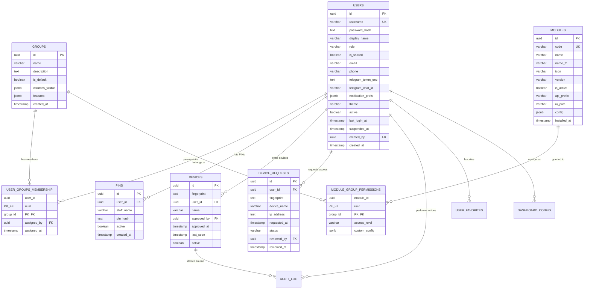
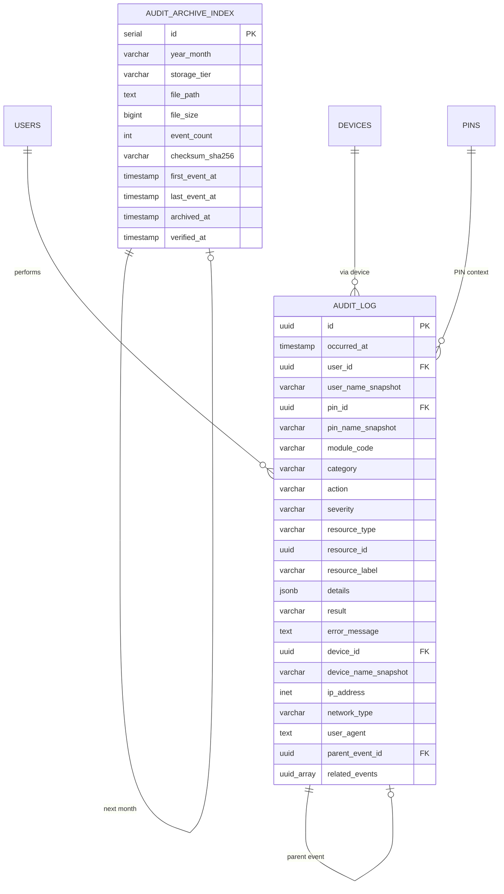
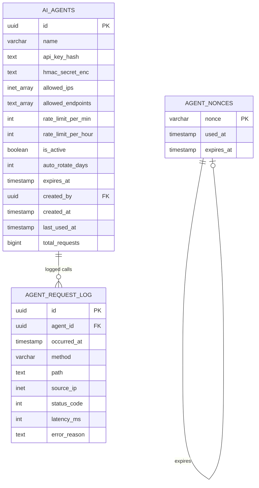
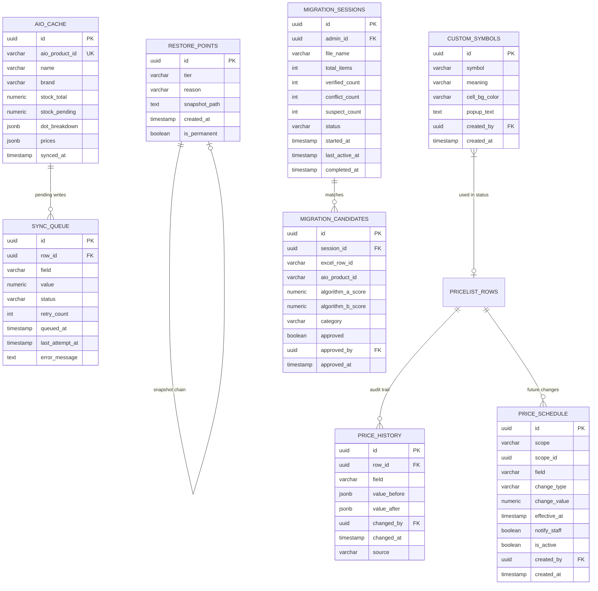
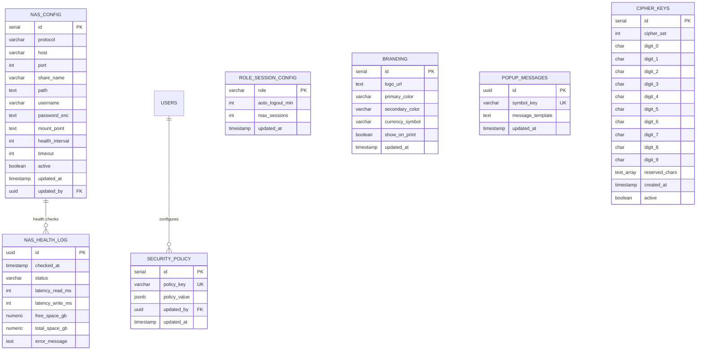
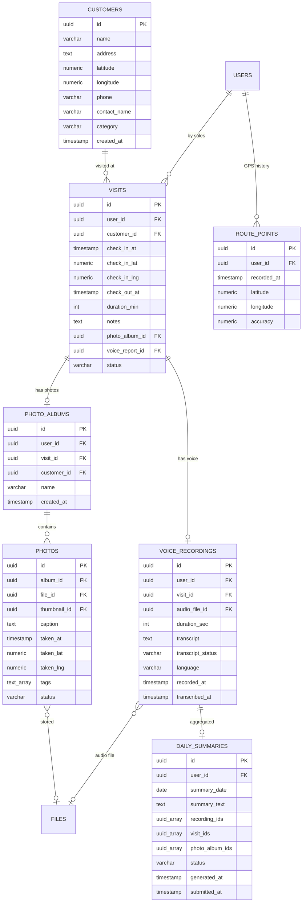
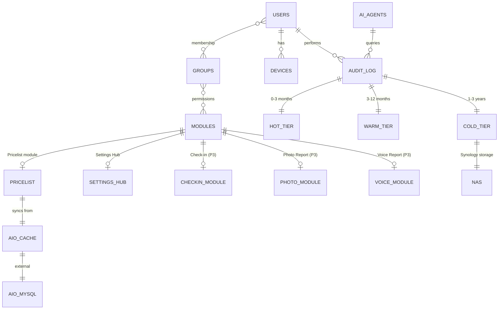

# 📊 TKC SuperApp — Database ERD (Entity Relationship Diagram)

| Field | Value |
|---|---|
| **Document Type** | Database Schema Visual Reference |
| **Version** | 1.0 |
| **Date** | 2026-05-12 |
| **Owner** | ชิบะน้อย (TKC AUTO PLUS) |
| **Database** | PostgreSQL 16 + pgvector |
| **Format** | Mermaid ER Diagrams |

---

## How to View Mermaid Diagrams

- **GitHub/GitLab:** Auto-renders
- **VS Code:** Install "Mermaid Preview" extension
- **Browser:** Use https://mermaid.live/
- **Notion/Obsidian:** Native support

---

## Schema Organization

```
PostgreSQL Database: tkc_superapp
├── core.*           (shared services)
├── pricelist.*      (Pricelist module)
├── settings_hub.*   (Settings module)
├── checkin.*        (Phase 3)
├── photo_report.*   (Phase 3)
└── voice_report.*   (Phase 3)
```

---

# 1. Core Identity Schema



**Key Relationships:**
- 1 User → many groups (max 3) via USER_GROUPS_MEMBERSHIP
- 1 User → many devices (whitelisted)
- 1 Shared User → many PINs (e.g., Counter shared)
- 1 Group → many module permissions

---

# 2. Audit Log Schema



**3-Tier Storage:**
- Hot (PostgreSQL `audit_log`): 0-3 months
- Warm (local SSD .jsonl.gz): 3-12 months
- Cold (NAS .jsonl.gz): 1-3 years

**Index covers all tiers** for unified query.

---

# 3. AI Agent + Security Schema



**Security Layers:**
- API Key + HMAC + IP whitelist + Nonce + Rate limit
- Auto rotation 180 days
- Nonce TTL 10 min (replay protection)

---

# 4. Pricelist Module Schema

```mermaid
erDiagram
    PRICELIST_CATEGORIES ||--o{ PRICELIST_SHEETS : "contains"
    PRICELIST_SHEETS ||--o{ PRICELIST_ROWS : "has rows"
    PRICELIST_SHEETS ||--o{ PAGE_NOTES : "has notes"
    PRICELIST_SHEETS ||--o{ BUNDLES : "has bundles"
    PRICELIST_CATEGORIES ||--o| CATEGORY_CR_CONFIG : "CR mode"
    
    BUNDLES ||--o{ BUNDLE_ROWS : "contains"
    BUNDLE_ROWS ||--o{ BUNDLE_COMPONENTS : "made of"
    BUNDLE_COMPONENTS }o--o| PRICELIST_ROWS : "references"
    
    CR_TIERS ||--o{ CR_TIER_ROWS : "tiers"
    CATEGORY_CR_CONFIG }o--o| CR_TIERS : "custom tier"
    
    PRICELIST_ROWS ||--o{ PRICE_HISTORY : "history"
    PRICELIST_ROWS ||--o{ PRICE_SCHEDULE : "scheduled"
    PRICELIST_ROWS }o--o| AIO_CACHE : "AIO source"
    PRICELIST_ROWS ||--o{ SYNC_QUEUE : "queued sync"
    
    USERS ||--o{ USER_FAVORITES : "favs"
    USER_FAVORITES }o--|| PRICELIST_ROWS : "favorited row"
    
    USERS ||--o{ SEARCH_HISTORY : "searches"
    
    PRICELIST_CATEGORIES {
        uuid id PK
        varchar name
        varchar code
        int sort_order
        jsonb schema_def
        jsonb global_vars
    }
    
    PRICELIST_SHEETS {
        uuid id PK
        uuid category_id FK
        varchar name
        varchar page_number
        varchar subtitle
        jsonb section_headers
        int sort_order
    }
    
    PRICELIST_ROWS {
        uuid id PK
        uuid sheet_id FK
        int row_index
        varchar aio_product_id
        varchar status
        boolean is_oem
        jsonb data
        jsonb formatting
        timestamp created_at
        timestamp updated_at
        uuid updated_by FK
        timestamp deleted_at
    }
    
    BUNDLES {
        uuid id PK
        uuid sheet_id FK
        varchar name
        int max_rows
        int sort_order
    }
    
    BUNDLE_ROWS {
        uuid id PK
        uuid bundle_id FK
        varchar size_label
        varchar brand_label
        varchar annotation
        numeric retail_total
        numeric sales_amount
        int sort_order
    }
    
    BUNDLE_COMPONENTS {
        uuid id PK
        uuid bundle_row_id FK
        uuid source_row_id FK
        numeric manual_value
        varchar display_prefix
        int sort_order
    }
    
    CR_TIERS {
        uuid id PK
        varchar scope
        uuid scope_id
        varchar name
        boolean is_active
    }
    
    CR_TIER_ROWS {
        uuid id PK
        uuid cr_tier_id FK
        numeric price_min
        numeric price_max
        numeric surcharge
        int sort_order
    }
    
    CATEGORY_CR_CONFIG {
        uuid category_id PK_FK
        varchar cr_mode
        uuid custom_tier_id FK
    }
```

**Key Concepts:**
- `data` JSONB stores schema-defined fields (cipher applied at display)
- `aio_product_id` links to AIO_CACHE for stock/DOT
- Bundle = N rows, each row has M components
- CR tier global → per-category override

---

# 5. Pricelist Operational Schema



---

# 6. Settings Hub Schema



---

# 7. Phase 3 Modules (Planned)



---

# 8. Full System Overview (Simplified)



---

# 9. Indexes & Performance

## Critical Indexes

```sql
-- Audit Log (high volume)
CREATE INDEX idx_audit_log_occurred ON core.audit_log(occurred_at DESC);
CREATE INDEX idx_audit_log_user ON core.audit_log(user_id, occurred_at DESC);
CREATE INDEX idx_audit_log_module ON core.audit_log(module_code, occurred_at DESC);
CREATE INDEX idx_audit_log_severity ON core.audit_log(severity) WHERE severity IN ('critical', 'warning');

-- Pricelist (search performance)
CREATE INDEX idx_pricelist_rows_sheet ON pricelist.rows(sheet_id, row_index);
CREATE INDEX idx_pricelist_rows_aio ON pricelist.rows(aio_product_id);
CREATE INDEX idx_pricelist_rows_status ON pricelist.rows(status) WHERE deleted_at IS NULL;
CREATE INDEX idx_pricelist_data_gin ON pricelist.rows USING gin(data);

-- pg_trgm for fuzzy search
CREATE INDEX idx_pricelist_data_trgm ON pricelist.rows USING gin((data->>'name') gin_trgm_ops);

-- Sync queue
CREATE INDEX idx_sync_queue_status ON pricelist.sync_queue(status, queued_at);

-- Users
CREATE INDEX idx_users_username ON core.users(username) WHERE active = true;
CREATE INDEX idx_users_role ON core.users(role) WHERE active = true;
```

---

# 10. Data Volume Estimates

```
Phase 1 (Year 1):

core.users:                   30 rows
core.groups:                  ~14 rows (4 default + 10 custom max)
core.devices:                 ~100 rows (30 users × ~3 devices each)
core.audit_log (hot):         ~3M rows/year (~600 MB)
core.audit_log (warm):        ~1.5M rows/9months (.jsonl.gz)
core.audit_log (cold):        ~3M rows/2years (.jsonl.gz on NAS)

pricelist.categories:         ~10
pricelist.sheets:             ~64
pricelist.rows:               ~2,629
pricelist.bundles:            ~50
pricelist.bundle_rows:        ~200
pricelist.price_history:      ~50,000/year
pricelist.sync_queue:         ~100 at any time (transient)

Total DB size:                ~5-8 GB after Year 1
                              ~10-15 GB after Year 3 (with audit hot tier)
                              
NAS cold storage:             ~1.5 GB/year
```

---

# 11. Foreign Key Strategy

**Cross-Schema FK Rules:**

```
✅ ALLOWED FKs:
- Within same schema (pricelist.rows → pricelist.sheets)
- core.* referenced from anywhere (user_id, group_id, etc.)

❌ AVOID FKs:
- Between module schemas (don't FK from checkin.* to photo_report.*)
- Use UUID with soft references + cleanup workers

🔄 Cleanup Workers:
- Periodic check: orphaned rows
- Soft-delete cleanup: 30-day retention
```

**Example: Photo Report → Visit linkage**
```sql
-- AVOID:
ALTER TABLE photo_report.albums 
  ADD FOREIGN KEY (visit_id) REFERENCES checkin.visits(id);

-- PREFER:
-- Use UUID reference, no FK constraint
-- Periodic cleanup job verifies references
```

---

# 12. Schema Evolution Strategy

```
Each module has alembic/ migrations:
  
backend/modules/pricelist/migrations/
  20260512_001_initial.py
  20260601_002_add_top_selling_view.py
  ...

Rules:
✅ Backward-compatible changes (add column, add index)
⚠️ Breaking changes require versioned migration with downtime plan
❌ Cross-schema breaking changes need coordination across modules

Tools:
- Alembic for Python migrations
- Schema validation in CI/CD
- Migration tests before deployment
```

---

# 13. Backup Strategy

```
Daily Backups (Spark #1):
  - pg_dump --schema=core
  - pg_dump --schema=pricelist
  - pg_dump --schema=settings_hub
  - 3 daily rotations (oldest deleted)

Hourly Snapshots (Pricelist only):
  - WAL archives
  - 3 hourly rotations

Manual Snapshots:
  - Admin-triggered
  - 3 retained (oldest deleted)

PERMANENT:
  - Launch Day backup (immutable)
  - Cipher backup card (PDF + physical printed copy)
  - AIO field 1-4 INITIAL backup (before first write)

Off-NAS Backup (Quarterly):
  - Manual export to external drive
  - Stored offsite
```

---

**End of Database ERD v1.0**

| Version | Date | Notes |
|---|---|---|
| 1.0 | 2026-05-12 | Initial ERD covering all Phase 1 + Phase 3 schemas |
