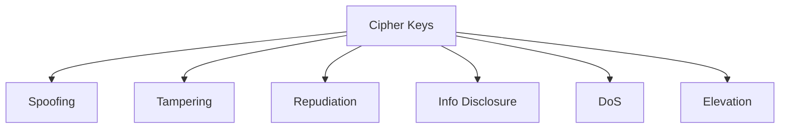

# 🔐 TKC SuperApp — Threat Model (STRIDE Analysis)

| Field | Value |
|---|---|
| **Document Type** | Security Threat Model |
| **Version** | 1.0 |
| **Date** | 2026-05-12 |
| **Owner** | ชิบะน้อย (TKC AUTO PLUS) |
| **Methodology** | STRIDE (Microsoft) |
| **Scope** | TKC SuperApp + Pricelist + Settings Hub |
| **Classification** | Internal Use Only |

---

## STRIDE Framework

| Letter | Category | คำอธิบาย |
|---|---|---|
| **S** | Spoofing | ปลอมตัวเป็นคนอื่น (impersonation) |
| **T** | Tampering | แก้ข้อมูลโดยไม่ได้รับอนุญาต |
| **R** | Repudiation | ปฏิเสธว่าทำการกระทำ (ไม่มี audit) |
| **I** | Information Disclosure | ข้อมูลรั่วถึงคนไม่ควรเห็น |
| **D** | Denial of Service | ทำให้ระบบใช้งานไม่ได้ |
| **E** | Elevation of Privilege | ยกระดับสิทธิ์เกินที่ควรมี |

---

## Risk Scoring

| Likelihood × Impact | Critical | High | Medium | Low |
|---|---|---|---|---|
| **High** | 🔴 R1 | 🔴 R2 | 🟡 R3 | 🟢 R4 |
| **Medium** | 🔴 R2 | 🟡 R3 | 🟡 R4 | 🟢 R5 |
| **Low** | 🟡 R3 | 🟡 R4 | 🟢 R5 | 🟢 R6 |

**Action Levels:**
- 🔴 R1-R2: Must mitigate before production
- 🟡 R3-R4: Mitigate before Phase 1 launch
- 🟢 R5-R6: Monitor, accept risk

---

# 1. Critical Assets Inventory

| Asset | Sensitivity | Why |
|---|---|---|
| 🔑 Cipher Keys (#1, #2) | Critical | Compromise = all prices exposed |
| 💰 AIO Database (real prices) | Critical | Core business data |
| 🔐 User Authentication (JWT) | Critical | Access control |
| 🤖 AI Agent API Keys | High | Limited but valuable access |
| 📋 Audit Log | High | Compliance + forensics |
| 👥 User PII (phone, email) | Medium | Internal staff data |
| 📦 Product Stock + DOT | Medium | Business intelligence |
| 🖼️ Product Images | Low | Public-ish data |
| 📞 Customer Quote Data | Medium | Limited PII |
| 🔄 AIO Sync Credentials | Critical | Direct DB access |

---

# 2. ASSET: Cipher Keys

**Why Critical:**
- Cipher = display encoding for ราคาส่ง (B/A/S) and ทุน (cost)
- Leak → all wholesale prices exposed to competitors
- Damage: Permanent (cipher hard to rotate without operational disruption)



## Threats

### 🎭 Spoofing (S)

| ID | Threat | Likelihood | Impact | Risk |
|---|---|---|---|---|
| S1.1 | Attacker impersonates Admin to view cipher | Low | Critical | 🟡 R3 |

**Attack Vectors:**
- Stolen Admin password
- Session hijack
- Social engineering

**Mitigations:**
- ✅ JWT + Device fingerprint
- ✅ Office IP auto-approve, external require approval
- ✅ Audit log for cipher views
- ✅ 5-fail lockout / 5 min
- ⚠️ Consider 2FA for cipher access (Phase 2)

---

### 🔨 Tampering (T)

| ID | Threat | Likelihood | Impact | Risk |
|---|---|---|---|---|
| T1.1 | Admin compromise → cipher swap → exfil | Low | Critical | 🟡 R3 |
| T1.2 | Cipher backup card altered after print | Very Low | Medium | 🟢 R5 |

**Mitigations:**
- ✅ Cipher change requires admin re-auth + reason
- ✅ Critical severity audit + Telegram alert on change
- ✅ DB stores REAL numbers — cipher is display only (can recover)
- ✅ Backup card stored offline, in secure location
- ⚠️ Require 2-admin approval for cipher change (Phase 2)

---

### ❌ Repudiation (R)

| ID | Threat | Likelihood | Impact | Risk |
|---|---|---|---|---|
| R1.1 | Admin denies cipher change after leak | Medium | High | 🟡 R3 |

**Mitigations:**
- ✅ Audit log immutable + 3-year retention
- ✅ Snapshot before change
- ✅ Reason field required (forensic trail)
- ✅ Telegram alert at change time = proof of timing
- ⚠️ Add: signed audit entries (cryptographic) (Phase 2)

---

### 🔓 Information Disclosure (I)

| ID | Threat | Likelihood | Impact | Risk |
|---|---|---|---|---|
| I1.1 | Cipher leak via screenshot/photo | High | Critical | 🔴 R1 |
| I1.2 | Cipher backup card photographed | Medium | Critical | 🔴 R2 |
| I1.3 | Cipher in browser cache | Low | High | 🟡 R3 |
| I1.4 | Cipher in browser memory dump | Very Low | High | 🟢 R5 |

**Mitigations:**
- ✅ Cipher only loaded for Admin role
- ✅ Cipher transmitted over TLS 1.3
- ✅ No cipher in browser localStorage (memory only)
- ⚠️ **Watermark cipher display with user+timestamp** (Phase 2)
- ⚠️ Backup card stored in physical safe
- ⚠️ Periodic cipher rotation policy (yearly)
- ⚠️ Disable screenshot during cipher view (mobile)

---

### 💥 Denial of Service (D)

| ID | Threat | Likelihood | Impact | Risk |
|---|---|---|---|---|
| D1.1 | Brute force cipher decode | Very Low | Low | 🟢 R6 |

**Analysis:**
- Cipher space = 10! permutations × A toggle ≈ 3.6 million
- Without sample data → unbreakable practically
- With samples → still requires social access first

**Mitigations:**
- ✅ Rate limiting on viewer
- ✅ Audit log unusual access patterns

---

### ⬆️ Elevation of Privilege (E)

| ID | Threat | Likelihood | Impact | Risk |
|---|---|---|---|---|
| E1.1 | Non-Admin user gains Admin access | Low | Critical | 🟡 R3 |
| E1.2 | Dealer Sales sees ราคาขายปลีก | Low | High | 🟡 R3 |

**Mitigations:**
- ✅ Permission matrix per group
- ✅ Column-level visibility per role
- ✅ Group change requires relogin
- ✅ Audit log for permission changes
- ⚠️ Test: try elevation in QA before launch

---

# 3. ASSET: AIO Database Connection

**Why Critical:**
- Direct write access to AIO → can corrupt all prices
- Field 5 NEVER touch — but bug could touch anyway
- AIO down = sales operations stop

## Threats

### 🎭 Spoofing (S)

| ID | Threat | Likelihood | Impact | Risk |
|---|---|---|---|---|
| S2.1 | Fake AIO server (MITM) | Very Low | Critical | 🟡 R3 |

**Mitigations:**
- ✅ AIO on LAN only
- ✅ DB credentials in env vars + encrypted
- ⚠️ Add: cert pinning if SSL used (Phase 2)

---

### 🔨 Tampering (T)

| ID | Threat | Likelihood | Impact | Risk |
|---|---|---|---|---|
| T2.1 | Sync bug writes to AIO Field 5 | Low | Critical | 🔴 R2 |
| T2.2 | Malicious admin schedules bad prices | Low | High | 🟡 R3 |
| T2.3 | AIO data corruption via sync race condition | Medium | High | 🟡 R3 |

**Mitigations:**
- ✅ Code: explicit allowlist of fields to update (NEVER include 5)
- ✅ Unit tests: verify field 5 untouched
- ✅ INITIAL backup PERMANENT before any write
- ✅ Sync queue with retry + audit per item
- ✅ Manual approval for bulk price changes (>100 rows)
- ⚠️ Periodic AIO data integrity check (compare with backup)

---

### ❌ Repudiation (R)

| ID | Threat | Likelihood | Impact | Risk |
|---|---|---|---|---|
| R2.1 | Sync failure blamed on system | Medium | Medium | 🟡 R4 |

**Mitigations:**
- ✅ Per-sync audit log
- ✅ Queue history retained 90 days
- ✅ Telegram alerts on fail (timestamped proof)

---

### 🔓 Information Disclosure (I)

| ID | Threat | Likelihood | Impact | Risk |
|---|---|---|---|---|
| I2.1 | AIO credentials leak via env vars dump | Low | Critical | 🟡 R3 |
| I2.2 | AIO data leaked via API endpoint misconfig | Low | High | 🟡 R3 |

**Mitigations:**
- ✅ Credentials encrypted at rest
- ✅ .env not committed to git
- ✅ API endpoints scope-limited (no /api/aio/*)
- ✅ AIO data only flows through Pricelist module APIs

---

### 💥 Denial of Service (D)

| ID | Threat | Likelihood | Impact | Risk |
|---|---|---|---|---|
| D2.1 | Sync overload AIO MySQL | Low | High | 🟡 R4 |
| D2.2 | AIO down disrupts pricelist | Medium | Medium | 🟡 R4 |

**Mitigations:**
- ✅ AIO load <5% (cached reads, batched writes)
- ✅ Sync queue + exponential backoff
- ✅ Cached data available offline
- ✅ Pricelist works in degraded mode (last sync data)

---

### ⬆️ Elevation of Privilege (E)

| ID | Threat | Likelihood | Impact | Risk |
|---|---|---|---|---|
| E2.1 | Sync service compromised → full AIO write access | Very Low | Critical | 🟡 R3 |

**Mitigations:**
- ✅ Sync service runs as restricted user
- ✅ Network isolation (Spark #1 internal)
- ✅ Service account password separate from admin

---

# 4. ASSET: User Authentication (JWT + Devices)

## Threats

### 🎭 Spoofing (S)

| ID | Threat | Likelihood | Impact | Risk |
|---|---|---|---|---|
| S3.1 | JWT token theft via XSS | Low | High | 🟡 R3 |
| S3.2 | Stolen credentials (phishing) | Medium | High | 🔴 R2 |
| S3.3 | Session hijack on shared computer | Medium | Medium | 🟡 R3 |
| S3.4 | Device fingerprint spoofing | Low | Medium | 🟢 R5 |

**Mitigations:**
- ✅ JWT HttpOnly cookies (XSS-resistant)
- ✅ CSP headers (prevent inline scripts)
- ✅ Auto-logout after idle (15-60 min per role)
- ✅ Device whitelist for external IPs
- ✅ Audit log all logins
- ⚠️ Add: 2FA for Admin (Phase 2)
- ⚠️ Login notification (Telegram) for new device

---

### 🔨 Tampering (T)

| ID | Threat | Likelihood | Impact | Risk |
|---|---|---|---|---|
| T3.1 | JWT signature forgery | Very Low | Critical | 🟡 R3 |
| T3.2 | Permission tampering via UI | Low | High | 🟡 R3 |

**Mitigations:**
- ✅ Strong JWT secret (env var, 256-bit)
- ✅ Backend re-verifies permissions per request (don't trust UI)
- ✅ Audit log all permission changes

---

### ❌ Repudiation (R)

| ID | Threat | Likelihood | Impact | Risk |
|---|---|---|---|---|
| R3.1 | User denies actions (counter shared) | Medium | Medium | 🟡 R4 |

**Mitigations:**
- ✅ PIN per staff in shared accounts
- ✅ Audit log captures: user + PIN holder
- ✅ Device + IP captured in audit
- ✅ Snapshots of action context

---

### 🔓 Information Disclosure (I)

| ID | Threat | Likelihood | Impact | Risk |
|---|---|---|---|---|
| I3.1 | Password reset email leak (if email used) | N/A | — | Skip (PDPA scope) |
| I3.2 | Other users' info via API enumeration | Low | Medium | 🟡 R4 |

**Mitigations:**
- ✅ Admin-only password reset (no email link)
- ✅ User list API requires admin permission
- ✅ Audit log access attempts

---

### 💥 Denial of Service (D)

| ID | Threat | Likelihood | Impact | Risk |
|---|---|---|---|---|
| D3.1 | Brute force lockout abuse (lock real users) | Medium | Medium | 🟡 R4 |
| D3.2 | Mass force-logout abuse | Low | Medium | 🟢 R5 |

**Mitigations:**
- ✅ Lockout per device+username (not just username)
- ✅ Auto-unlock after 5 min
- ✅ Force-logout requires Admin role + audit
- ⚠️ CAPTCHA after 3 fails (Phase 2)

---

### ⬆️ Elevation of Privilege (E)

| ID | Threat | Likelihood | Impact | Risk |
|---|---|---|---|---|
| E3.1 | Sales accesses Admin endpoints | Low | High | 🟡 R3 |
| E3.2 | API auth bypass | Very Low | Critical | 🟡 R3 |

**Mitigations:**
- ✅ Middleware: permission check per endpoint
- ✅ Frontend hides admin UI (defense in depth)
- ✅ Pen testing before launch
- ✅ Regular dependency updates (frameworks)

---

# 5. ASSET: AI Agent Gateway (พอร์ช)

## Threats

### 🎭 Spoofing (S)

| ID | Threat | Likelihood | Impact | Risk |
|---|---|---|---|---|
| S4.1 | Fake agent uses stolen API key | Low | Medium | 🟡 R4 |

**Mitigations:**
- ✅ HMAC signature required (key alone insufficient)
- ✅ IP whitelist (LAN only)
- ✅ Nonce prevents replay

---

### 🔨 Tampering (T)

| ID | Threat | Likelihood | Impact | Risk |
|---|---|---|---|---|
| T4.1 | Request body modified in transit | Very Low | Medium | 🟢 R5 |

**Mitigations:**
- ✅ HMAC covers request body
- ✅ TLS (Cloudflare Tunnel for external, plaintext OK on LAN)

---

### ❌ Repudiation (R)

| ID | Threat | Likelihood | Impact | Risk |
|---|---|---|---|---|
| R4.1 | Agent denies suspicious activity | Low | Medium | 🟢 R5 |

**Mitigations:**
- ✅ Every agent request logged (agent_request_log)
- ✅ Signed with HMAC = non-repudiable
- ✅ Rate limits captured

---

### 🔓 Information Disclosure (I)

| ID | Threat | Likelihood | Impact | Risk |
|---|---|---|---|---|
| I4.1 | Agent leaks business data | Low | High | 🟡 R3 |
| I4.2 | Agent compromise → exfil audit log | Low | Medium | 🟡 R4 |

**Mitigations:**
- ✅ Scope-limited endpoints (no /api/pricelist/*)
- ✅ Response filtering (no prices, no PII)
- ✅ Rate limits prevent mass exfil
- ✅ Audit log of agent queries
- ⚠️ Alert on unusual query patterns (Phase 2)

---

### 💥 Denial of Service (D)

| ID | Threat | Likelihood | Impact | Risk |
|---|---|---|---|---|
| D4.1 | Agent overloads gateway | Low | Low | 🟢 R6 |

**Mitigations:**
- ✅ Rate limits (100/min, 1000/hour)
- ✅ HMAC verification cost moderate
- ✅ Nonce check via Redis (fast)

---

### ⬆️ Elevation of Privilege (E)

| ID | Threat | Likelihood | Impact | Risk |
|---|---|---|---|---|
| E4.1 | Agent bypasses scope restrictions | Low | High | 🟡 R3 |

**Mitigations:**
- ✅ Endpoint allowlist enforced at middleware
- ✅ No /api/agent/* alias to other endpoints
- ✅ Penetration test agent gateway

---

# 6. ASSET: Audit Log

## Threats

### 🎭 Spoofing (S)

| ID | Threat | Likelihood | Impact | Risk |
|---|---|---|---|---|
| S5.1 | Forge audit entries | Very Low | High | 🟡 R3 |

**Mitigations:**
- ✅ Only system creates audit entries (no user API)
- ✅ Append-only (no UPDATE/DELETE on audit_log)
- ⚠️ Add: cryptographic chaining (Phase 2, like blockchain)

---

### 🔨 Tampering (T)

| ID | Threat | Likelihood | Impact | Risk |
|---|---|---|---|---|
| T5.1 | Delete audit entries | Low | High | 🟡 R3 |
| T5.2 | Modify archived audit files on NAS | Low | High | 🟡 R3 |

**Mitigations:**
- ✅ DB user has no DELETE on audit_log
- ✅ Application code never deletes (only archives)
- ✅ Archive files have SHA256 checksum
- ✅ NAS file permissions: read-only for app
- ✅ Verify checksum on cold tier query

---

### 🔓 Information Disclosure (I)

| ID | Threat | Likelihood | Impact | Risk |
|---|---|---|---|---|
| I5.1 | Audit log reveals sensitive data | Medium | Medium | 🟡 R4 |

**Mitigations:**
- ✅ Cipher codes masked in export by default
- ✅ Admin-only access
- ✅ AI Agent gets filtered view (no details)
- ⚠️ Sensitive details hashed in `details` JSONB (Phase 2)

---

# 7. ASSET: Quote Links (Public)

## Threats

### 🎭 Spoofing (S)

| ID | Threat | Likelihood | Impact | Risk |
|---|---|---|---|---|
| S6.1 | Fake TKC quote sent to customers | Medium | Medium | 🟡 R4 |

**Mitigations:**
- ✅ Quote URL on tkc.co domain (verifiable)
- ✅ TKC contact info on quote
- ⚠️ Add: signed URLs (Phase 2)

---

### 🔓 Information Disclosure (I)

| ID | Threat | Likelihood | Impact | Risk |
|---|---|---|---|---|
| I6.1 | Quote URL guessable | Low | Low | 🟢 R5 |

**Mitigations:**
- ✅ Short ID uses sufficient entropy (8+ chars)
- ✅ 7-day expiry
- ✅ No iteration possible (random IDs)

---

# 8. ASSET: Backups + Restore Points

## Threats

### 🔨 Tampering (T)

| ID | Threat | Likelihood | Impact | Risk |
|---|---|---|---|---|
| T7.1 | Backup files corrupted | Low | Critical | 🔴 R2 |
| T7.2 | Restore point manipulation | Low | High | 🟡 R3 |

**Mitigations:**
- ✅ Checksum verification on every backup
- ✅ Restore point hash in DB
- ✅ Off-NAS quarterly backup (offsite)
- ⚠️ Test restore drills quarterly

---

### 💥 Denial of Service (D)

| ID | Threat | Likelihood | Impact | Risk |
|---|---|---|---|---|
| D7.1 | NAS full → no new archives | Medium | High | 🟡 R3 |

**Mitigations:**
- ✅ Auto-monitor NAS free space
- ✅ Telegram alert at <10%
- ✅ 3-year purge policy enforced

---

# 9. ASSET: Customer Quote Data

**Note:** Internal organization use only (no PDPA scope per Owner directive 2026-05-12)

## Threats

### 🔓 Information Disclosure (I)

| ID | Threat | Likelihood | Impact | Risk |
|---|---|---|---|---|
| I8.1 | Quote contains customer phone shared externally | Low | Low | 🟢 R5 |

**Mitigations:**
- ✅ Quote link expiry 7 days
- ✅ TKC contact info instead of customer info
- ✅ Audit log quote views

---

# 10. SPECIAL: Insider Threats

**Why important:** ทุกระบบเสี่ยงต่อพนักงานปัจจุบัน/อดีต

## Threats

| ID | Threat | Likelihood | Impact | Risk |
|---|---|---|---|---|
| I9.1 | Resigning admin takes cipher | Low | Critical | 🔴 R2 |
| I9.2 | Disgruntled user leaks pricelist | Medium | High | 🔴 R2 |
| I9.3 | Sales rep shares quotes externally | Medium | Medium | 🟡 R4 |
| T9.1 | Admin sabotages on departure | Low | Critical | 🟡 R3 |

**Mitigations:**
- ✅ Audit log captures all access (after-the-fact detection)
- ✅ Force logout + delete user immediately on resignation
- ✅ Cipher rotation after admin departure (recommended)
- ✅ Critical events Telegram alert (real-time)
- ✅ Backup AIO field 1-4 PERMANENT (sabotage recovery)
- ⚠️ Pre-departure checklist: revoke all access, change shared passwords
- ⚠️ Monitoring for unusual export patterns (Phase 2)

---

# 11. Risk Summary

## Critical Risks (Must Mitigate Before Production)

| ID | Threat | Mitigation Status |
|---|---|---|
| 🔴 I1.1 | Cipher screenshot leak | Watermarking pending (Phase 2) |
| 🔴 I1.2 | Backup card photographed | Physical security policy needed |
| 🔴 T2.1 | Sync writes to AIO Field 5 | Code allowlist + tests ✅ |
| 🔴 S3.2 | Phishing credentials | Training + 2FA for admin (Phase 2) |
| 🔴 T7.1 | Backup corruption | Checksum + offsite ✅ |
| 🔴 I9.1 | Admin takes cipher on resignation | Procedure + cipher rotation policy |
| 🔴 I9.2 | Disgruntled user leaks data | Audit alerts + access revocation |

## High Risks (Mitigate Before Phase 1 Launch)

| ID | Threat | Mitigation |
|---|---|---|
| 🟡 S1.1 | Admin impersonation | 2FA Phase 2 |
| 🟡 T1.1 | Admin compromise → cipher | 2-admin approval Phase 2 |
| 🟡 R1.1 | Repudiation of cipher change | Signed audit Phase 2 |
| 🟡 I1.3 | Cipher in browser cache | No localStorage, memory only ✅ |
| 🟡 E1.1 | Non-admin gains admin | Permission tests in QA |
| 🟡 E2.1 | Sync service compromise | Network isolation ✅ |
| 🟡 S3.1 | JWT theft via XSS | HttpOnly cookies + CSP ✅ |
| 🟡 T3.2 | Permission tampering | Backend re-verify ✅ |
| 🟡 E3.1 | Sales accesses admin | Middleware enforcement ✅ |
| 🟡 I4.1 | Agent business data leak | Scope + filtering ✅ |
| 🟡 E4.1 | Agent scope bypass | Pen test pre-launch |
| 🟡 T5.1 | Audit delete | Append-only DB ✅ |
| 🟡 T7.2 | Restore point manipulation | Hashes + verify ✅ |

---

# 12. Action Plan

## Pre-Launch (Phase 1)

```
🔴 Critical Actions:
[ ] AIO sync code review: verify field 5 protection
[ ] Pen test: admin elevation, agent scope
[ ] Cipher backup card secure storage policy
[ ] Pre-departure user offboarding checklist
[ ] Backup checksum verification automation
[ ] CSP headers configured
[ ] HttpOnly cookies validated
[ ] Rate limits tested

🟡 High Priority:
[ ] Permission matrix end-to-end test
[ ] Force-logout abuse prevention test
[ ] Audit log append-only enforcement
[ ] NAS file permissions read-only verified
[ ] Quote URL entropy verified
```

## Phase 2 Security Enhancements

```
[ ] 2FA for Admin accounts (TOTP)
[ ] Login notification via Telegram (new device)
[ ] CAPTCHA after 3 failed logins
[ ] Audit log cryptographic chaining
[ ] Cipher display watermarking
[ ] Audit details JSONB hashed for sensitive
[ ] AI Agent unusual pattern detection
[ ] Signed quote URLs
[ ] 2-admin approval for cipher changes
```

## Ongoing Security Operations

```
[ ] Quarterly: restore drill from backup
[ ] Quarterly: review audit logs for anomalies
[ ] Yearly: cipher rotation (after admin departure or as scheduled)
[ ] Yearly: penetration test
[ ] Yearly: review and update this threat model
[ ] On admin departure: force logout + cipher rotation + audit
```

---

# 13. Security Principles

```
1. DEFENSE IN DEPTH
   Multiple layers — compromise of one ≠ full breach
   Example: AI Agent has 5 layers of security

2. LEAST PRIVILEGE
   Each role/agent has minimum required access
   Example: Dealer Sales can't see ราคาขายปลีก

3. ZERO TRUST
   Verify every request, even from "trusted" sources
   Example: Backend re-verifies JWT permissions

4. AUDIT EVERYTHING
   All sensitive actions logged with full context
   Example: 3-tier audit log, 3-year retention

5. FAIL SECURE
   Errors default to denying access
   Example: AIO down → don't write (queue instead)

6. SEPARATION OF DUTIES
   Critical actions require multiple parties
   Example: 2-admin approval for cipher (Phase 2)

7. IMMUTABLE AUDIT
   Cannot be deleted or modified
   Example: append-only audit_log table

8. SECURITY BY DESIGN
   Built-in, not bolted-on
   Example: Cipher = display layer, DB stores real
```

---

# 14. Incident Response (Brief)

**Detailed runbook:** See `11_Operations_Runbook.md`

## Severity Triggers

```
🔴 SEV-1 (Immediate response):
   - Cipher key leak suspected
   - AIO data corruption confirmed  
   - Admin account compromised
   - Audit log tampering detected
   
🟡 SEV-2 (Within 1 hour):
   - Unusual access patterns
   - Failed login spike (>50/hour)
   - Sync failures lasting >30 min
   - Permission anomaly

🟢 SEV-3 (Same day):
   - Single failed login series
   - Device approval requests
   - Minor configuration issues
```

## Response Team

```
SEV-1: ชิบะน้อย + senior dev + security advisor
SEV-2: On-call dev + admin
SEV-3: Admin/IT staff
```

---

# 15. Compliance Notes

```
Scope: Internal organization use only
PDPA: NOT required per Owner directive 2026-05-12
Audit retention: 3 years (compliance + operational)
Backup: Daily + Hourly + Manual + Permanent (Launch Day)
Access control: RBAC + column-level
Encryption: TLS 1.3 transit, Argon2 passwords, encrypted secrets at rest
```

---

**End of Threat Model v1.0**

| Version | Date | Notes |
|---|---|---|
| 1.0 | 2026-05-12 | Initial STRIDE analysis across 10 critical assets |
